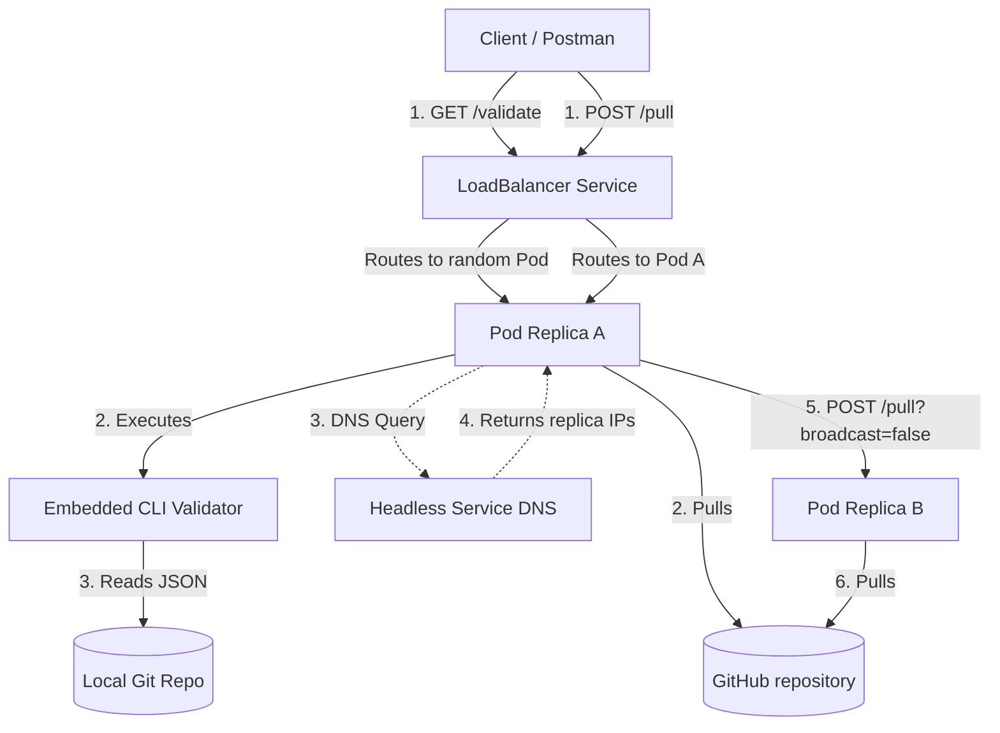

# Multi-Replica JSON Validation Architecture

This document describes the design, deployment, and verification steps for the Go-based Web API and CLI validation system running in Kubernetes.

---

## 1. Architectural Overview

The system consists of two primary Go projects deployed inside a single Kubernetes container:
- **Project `one` (Web API Server)**: Exposed externally on port `4000`. Receives REST validation calls, clones/manages the target Git repository, and returns structural validation outputs.
- **Project `two` (CLI Validator)**: An embedded executable binary compiled inside the server container that executes local JSON validations.



### Peer-to-Peer Sync Broadcast
Since the LoadBalancer service routes traffic to only one replica, performing a manual `git pull` on one pod would leave other replicas with outdated JSON files. 
To keep all replicas in sync without background polling loops:
1. When a client triggers `POST /pull` on Pod A, Pod A runs `git pull` locally.
2. Pod A queries the cluster DNS for `gin-server-headless` to discover the internal IP addresses of all replicas.
3. It filters out its own IP address (using the `POD_IP` environment variable provided by the Downward API).
4. Pod A sends an asynchronous background `POST /pull?broadcast=false` request to each peer replica (Pod B, Pod C, etc.).
5. Peers receive the endpoint call, run a local `git pull`, and stop broadcasting further to prevent routing loops.

---

## 2. Kubernetes Configuration

The deployment is managed by three YAML files in the `k8s/` folder:

### A. Deployment Spec ([k8s/deployment.yaml](file:///c:/Users/ADMIN/Desktop/notes/k8s/k8s/deployment.yaml))
Defines the `gin-server` pod replica set and injects the pod IP using the Downward API:
```yaml
apiVersion: apps/v1
kind: Deployment
metadata:
  name: gin-server
  labels:
    app: gin-server
spec:
  replicas: 2
  selector:
    matchLabels:
      app: gin-server
  template:
    metadata:
      labels:
        app: gin-server
    spec:
      containers:
      - name: gin-server
        image: gin-server:v1
        imagePullPolicy: IfNotPresent
        ports:
        - containerPort: 4000
        env:
        - name: POD_IP
          valueFrom:
            fieldRef:
              fieldPath: status.podIP
        envFrom:
        - configMapRef:
            name: gin-server-config
```

### B. Service Spec ([k8s/service.yaml](file:///c:/Users/ADMIN/Desktop/notes/k8s/k8s/service.yaml))
Exposes the externally facing LoadBalancer service along with the internal Headless Service for peer discovery:
```yaml
apiVersion: v1
kind: Service
metadata:
  name: gin-server-service
spec:
  selector:
    app: gin-server
  ports:
    - protocol: TCP
      port: 4000
      targetPort: 4000
  type: LoadBalancer
---
apiVersion: v1
kind: Service
metadata:
  name: gin-server-headless
spec:
  clusterIP: None
  selector:
    app: gin-server
  ports:
    - protocol: TCP
      port: 4000
      targetPort: 4000
```

---

## 3. Build & Deployment Steps

Follow these instructions to build and run the updated application stack in your local cluster:

### Step 1: Build the Docker Image
From the workspace root directory, build the image (tagged `v1`):
```powershell
docker build -t gin-server:v1 .
```

### Step 2: Clear Internal containerd Cache (If overriding tags)
If you overwrite an existing tag (like `v1`) and it does not update in Kubernetes, clear the containerd cache inside Docker Desktop:
```powershell
docker exec desktop-control-plane crictl rmi docker.io/library/gin-server:v1
```

### Step 3: Deploy to Kubernetes
Apply the configuration files:
```powershell
kubectl apply -f ./k8s
```

### Step 4: Verify the Pods
Verify that both replicas are running successfully:
```powershell
kubectl get pods
```

---

## 4. API Specification & Testing

Start port-forwarding to route traffic to the cluster:
```powershell
kubectl port-forward service/gin-server-service 4000:4000
```

### Endpoint 1: Run Validation (`GET /validate`)
Validates the target `file.json` inside the cloned repository directory and returns the Git commit ID it was validated against.

* **Method**: `GET`
* **URL**: `http://localhost:4000/validate`
* **PowerShell Call**:
  ```powershell
  Invoke-RestMethod -Uri http://localhost:4000/validate -Method Get
  ```
* **Success Response**:
  ```json
  {
    "status": "success",
    "message": "validation succeeded: no errors found",
    "commit_id": "9a5d2cd5d09bfce9c8fe1e6a3fe0433200550334",
    "details": {
      "errors": [],
      "warnings": []
    }
  }
  ```

---

### Endpoint 2: Synchronize Repository (`POST /pull`)
Triggers an on-demand `git pull` from GitHub and broadcasts the instruction to all other replicas in the cluster.

* **Method**: `POST`
* **URL**: `http://localhost:4000/pull`
* **PowerShell Call**:
  ```powershell
  Invoke-RestMethod -Uri http://localhost:4000/pull -Method Post
  ```
* **Response**:
  ```json
  {
    "status": "success",
    "message": "Git repository updated successfully",
    "output": "Already up to date.\n"
  }
  ```
