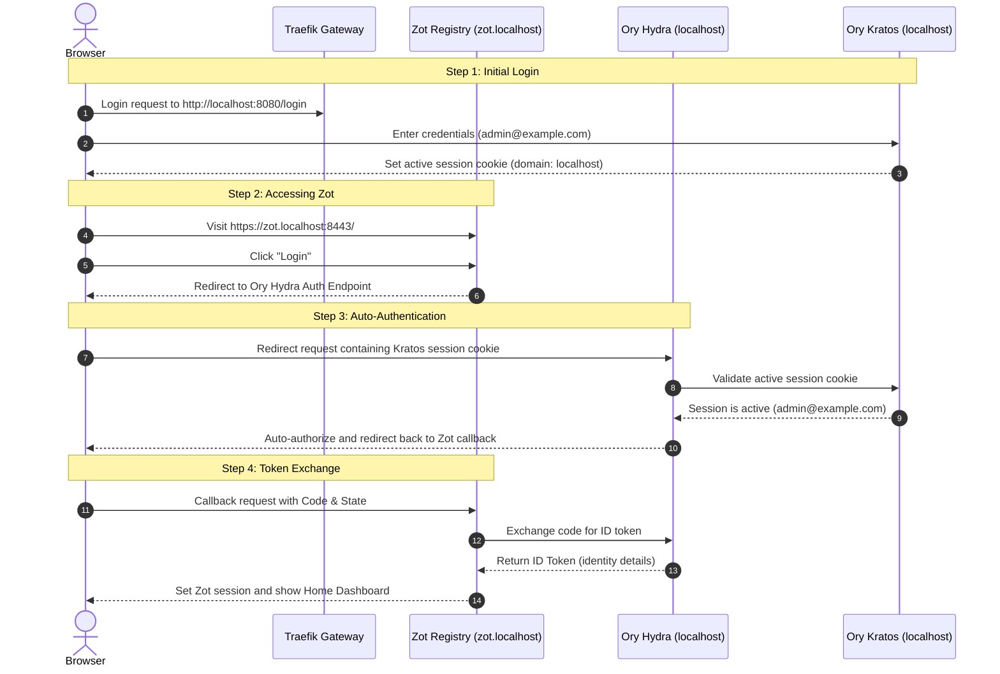

# Zot Registry & Ory Single Sign-On (SSO) Flow

This document explains the Single Sign-On (SSO) behavior between your custom application (running on `http://localhost:8080`) and the Zot Container Registry (running on `https://zot.localhost:8443`).

---

## 1. The SSO Experience

When you log into the system via `http://localhost:8080/login` first, and subsequently open `https://zot.localhost:8443/` and click **Login**, the registry dashboard logs you in **instantly without requesting your email and password again**. 

This is the standard and expected behavior of a properly configured OIDC Single Sign-On integration.

---

## 2. SSO Authentication Flow (Step-by-Step)



---

## 3. Required Configurations

This seamless authentication flow relies on the coordination of three configuration layers:

### A. Kratos Domain Cookie Configuration ([`kratos.yml`](file:///c:/Users/ADMIN/Desktop/notes/oryHydra/kratos.yml))
Kratos exposes its public endpoints on `http://localhost:8080/.ory/kratos/`. Because it shares the `localhost` domain, the browser stores Kratos' session cookie under `localhost`. This allows the cookie to be sent during the OIDC redirection requests to Ory Hydra (which also runs on `localhost`).

### B. Hydra Client Registry ([`k8s2/hydra.yaml`](file:///c:/Users/ADMIN/Desktop/notes/oryHydra/k8s2/hydra.yaml))
Ory Hydra trusts Zot as a registered client (`zot-client`) with permission to request identity data:
* **Scopes**: Includes `openid`, `profile`, and `email` to allow Zot to read the user's details.
* **Redirect URIs**: Whitelists `https://zot.localhost:8443/auth/callback/oidc` so Hydra knows it is safe to redirect back.

### C. Zot OIDC Integration ([`k8s2/zot.yaml`](file:///c:/Users/ADMIN/Desktop/notes/oryHydra/k8s2/zot.yaml))
Zot points to Ory Hydra as its trusted authority:
```json
"issuer": "http://localhost:8080/.ory/hydra/"
```
This configuration registers Hydra as Zot's OpenID Connect provider, letting Zot fetch user information and delegate login checks to Hydra.
