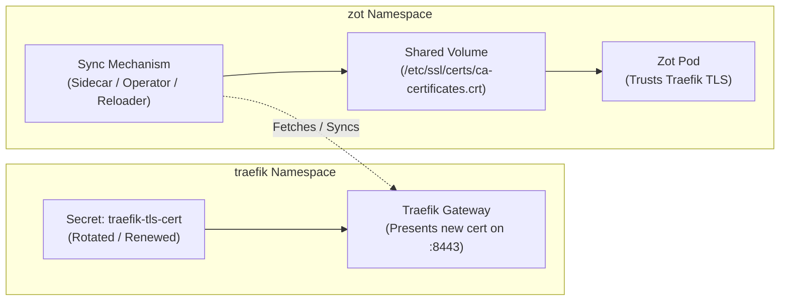

# Cross-Namespace TLS Certificate Rotation & Synchronization Strategies

This document outlines architectural patterns and solutions for synchronizing and rotating TLS certificates across Kubernetes namespaces, specifically addressing scenarios where **Traefik Gateway** (in the `traefik` namespace) has its TLS certificate renewed or rotated, and **Zot Registry** (in the `zot` namespace) must continuously trust it for OIDC/OAuth2 authentication.

---

## 1. The Challenge

1. **Namespace Isolation**: Kubernetes enforces strict namespace isolation. A Pod in the `zot` namespace cannot directly mount a `Secret` residing in the `traefik` namespace.
2. **Dynamic TLS Rotation**: If Traefik's TLS certificate is renewed, updated, or rotated multiple times post-deployment, consumer services like Zot must receive the updated CA/certificate without breaking TLS handshakes or causing OIDC `x509: certificate signed by unknown authority` errors.



---

## 2. Strategies & Architectural Patterns

### Strategy 1: Continuous Background Sidecar Sync (Zero Dependencies) ⭐
*Best for lightweight, self-contained setups without installing third-party cluster operators.*

Instead of an `initContainer` that only fetches the certificate once during pod startup, a lightweight sidecar container runs alongside Zot in the same Pod and periodically pulls Traefik's public certificate over TLS, saving it to a shared `emptyDir` volume.

#### Implementation in `zot-dp.yaml`:
```yaml
apiVersion: apps/v1
kind: Deployment
metadata:
  name: zot
  namespace: zot
spec:
  template:
    spec:
      containers:
        # 1. Main Zot Container
        - name: zot
          image: ghcr.io/project-zot/zot:v2.1.15
          volumeMounts:
            - name: cert-volume
              mountPath: /etc/ssl/certs/ca-certificates.crt
              subPath: ca-certificates.crt

        # 2. Continuous Cert Sync Sidecar
        - name: cert-sync-sidecar
          image: alpine:latest
          command:
            - /bin/sh
            - -c
            - |
              apk add --no-cache openssl > /dev/null 2>&1
              while true; do
                openssl s_client -showcerts -connect traefik.traefik.svc.cluster.local:8443 </dev/null 2>/dev/null | openssl x509 -outform PEM > /certs/ca-certificates.crt.tmp 2>/dev/null
                if [ -s /certs/ca-certificates.crt.tmp ]; then
                  mv /certs/ca-certificates.crt.tmp /certs/ca-certificates.crt
                fi
                sleep 60
              done
          volumeMounts:
            - name: cert-volume
              mountPath: /certs

      volumes:
        - name: cert-volume
          emptyDir: {}
```

#### Highlights:
* **Real-time Live Sync**: File updates in `emptyDir` are shared immediately across all containers in the Pod.
* **No Cluster Operators**: Zero Helm charts, zero CRDs, and zero extra RBAC permissions required.
* **Resilient**: If Traefik restarts or gets updated, the sidecar picks up the new certificate within 60 seconds.

---

### Strategy 2: Cross-Namespace Secret Mirroring (Emberstack Reflector / Kyverno)
*Best for standard Kubernetes environments where secrets need to be mirrored natively across namespaces.*

[Emberstack Reflector](https://github.com/emberstack/kubernetes-reflector) is a Kubernetes operator that watches Secrets/ConfigMaps and replicates them automatically to target namespaces based on annotations.

#### 1. Annotate the Secret in `traefik` namespace:
```yaml
apiVersion: v1
kind: Secret
metadata:
  name: traefik-tls-cert
  namespace: traefik
  annotations:
    reflector.v1.k8s.emberstack.com/reflection-allowed: "true"
    reflector.v1.k8s.emberstack.com/reflection-allowed-namespaces: "zot"
    reflector.v1.k8s.emberstack.com/reflection-auto-enabled: "true"
type: kubernetes.io/tls
data:
  tls.crt: <base64>
  tls.key: <base64>
```

#### 2. Mount the Mirrored Secret in `zot` namespace:
```yaml
      containers:
        - name: zot
          image: ghcr.io/project-zot/zot:v2.1.15
          volumeMounts:
            - name: cert-volume
              mountPath: /etc/ssl/certs/ca-certificates.crt
              subPath: tls.crt
      volumes:
        - name: cert-volume
          secret:
            secretName: traefik-tls-cert # Auto-created and synced by Reflector
```

#### Highlights:
* **Native Kubernetes Secrets**: No sidecar containers required in the application Pod.
* **Automatic Secret Propagation**: When Traefik's secret updates, Reflector pushes changes to the `zot` namespace, and kubelet updates the mounted secret volume.

---

### Strategy 3: Stakater Reloader (Rolling Restarts on Secret Changes)
*Best for CI/CD pipelines and environments that favor clean immutable restarts over in-place file mutation.*

[Stakater Reloader](https://github.com/stakater/Reloader) monitors ConfigMaps and Secrets. When a monitored Secret is modified, Reloader triggers a rolling restart (`rollout restart`) of associated Deployments.

#### Implementation:
1. When combined with an `initContainer`, whenever `traefik-tls-cert` changes, Reloader triggers a rolling restart of Zot.
2. The Zot `initContainer` boots up and fetches the new certificate immediately.

```yaml
apiVersion: apps/v1
kind: Deployment
metadata:
  name: zot
  namespace: zot
  annotations:
    secret.reloader.stakater.com/reload: "traefik-tls-cert"
```

---

### Strategy 4: Enterprise PKI (`cert-manager` + `trust-manager`)
*Best for production enterprise clusters utilizing internal Certificate Authorities (CA) or Vault / Let's Encrypt.*

1. **`cert-manager`** issues and automatically renews the TLS certificate in the `traefik` namespace.
2. **`trust-manager`** (the official companion operator by cert-manager) defines a `Bundle` resource that automatically distributes the CA public certificate into a `ConfigMap` in every namespace (`zot`, `default`, etc.).

```yaml
apiVersion: trust.cert-manager.io/v1alpha1
kind: Bundle
metadata:
  name: traefik-ca-bundle
spec:
  sources:
    - secret:
        name: "traefik-tls-cert"
        key: "tls.crt"
  target:
    configMap:
      key: "ca-certificates.crt"
```

Zot mounts the `ConfigMap` directly:
```yaml
      volumes:
        - name: cert-volume
          configMap:
            name: traefik-ca-bundle
```

---

## 3. Comparison Matrix

| Feature / Criteria | Strategy 1: Sidecar Sync | Strategy 2: Reflector | Strategy 3: Reloader | Strategy 4: cert-manager + trust-manager |
| :--- | :--- | :--- | :--- | :--- |
| **Requires Cluster Operator / Helm** | ❌ No | ⚠️ Yes (`emberstack/reflector`) | ⚠️ Yes (`stakater/reloader`) | ⚠️ Yes (`cert-manager` + `trust-manager`) |
| **Requires RBAC Permissions** | ❌ No | ⚠️ Yes (Cluster-wide Secret Read/Write) | ⚠️ Yes (Deployment Watcher) | ⚠️ Yes (Cluster-wide CRD / Bundle) |
| **Sync Speed** | ⏱️ Periodic (~60s loop) | ⚡ Instantaneous | 🔄 On Pod Rolling Restart | ⚡ Instantaneous (ConfigMap sync) |
| **Application Pod Overhead** | ~5MB RAM (Alpine sidecar) | 0MB | 0MB | 0MB |
| **Secret Duplication in Cluster** | ❌ No (Direct HTTPS query) | ⚠️ Yes (Mirrored Secret in `zot`) | ⚠️ Depends on secret location | ⚠️ ConfigMap in target namespaces |
| **Best Used For** | Standalone / Dev / Local Kind / Self-contained GitOps | General Cross-Namespace Secret Sync | Standard GitOps CI/CD Pipelines | Production Enterprise PKI |
