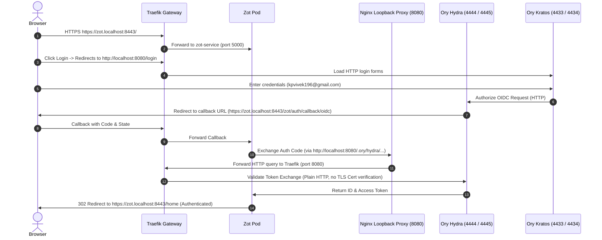

# Zot OIDC Integration - Solution B (Subdomain-Based Routing with HTTP Ory Stack)

This directory contains the Kubernetes manifests for **Solution B**, which deploys a subdomain-scoped container registry integrated with Ory Hydra and Kratos running over plain HTTP (`http://localhost:8080`).

---

## 1. Architecture & Routing Flow

Solution B serves Zot over HTTPS but routes all user authentication (Kratos) and identity APIs (Hydra) over insecure HTTP on port `8080`:

*   **Registry Domain**: `https://zot.localhost:8443` (subdomain-based over HTTPS)
*   **Ory Stack / UI / Backend**: `http://localhost:8080` (host-based over HTTP)



---

## 2. Key Features & Differences from Solution C

### A. HTTP Routing ([`traefik.yaml`](file:///c:/Users/ADMIN/Desktop/notes/oryHydra/k8s2/traefik.yaml))
*   Serves the Ory public APIs (Kratos, Hydra, backend-go, and React client) on the insecure `web` entrypoint (port `8080`).
*   Does **not** use the HTTP-to-HTTPS redirect middleware.

### B. Insecure Cookies ([`hydra.yaml`](file:///c:/Users/ADMIN/Desktop/notes/oryHydra/k8s2/hydra.yaml) & [`kratos.yaml`](file:///c:/Users/ADMIN/Desktop/notes/oryHydra/k8s2/kratos.yaml))
*   **Kratos**: Public base URL and return URLs are set to `http://localhost:8080`. Cookies are set **without** the `Secure` flag.
*   **Hydra**: Issuer is set to `http://localhost:8080/.ory/hydra/`. Cookies are set **without** the `Secure` flag.

### C. Zot Loopback Proxy ([`zot.yaml`](file:///c:/Users/ADMIN/Desktop/notes/oryHydra/k8s2/zot.yaml))
*   **Loopback HTTP**: The sidecar container (`loopback-proxy`) listens on port `8080` (HTTP) and forwards traffic to Traefik's HTTP port `8080` inside the cluster.
*   **Issuer Endpoint**: Configured with `"issuer": "http://localhost:8080/.ory/hydra/"`.
*   **No Cert Mount**: Since the connection to the OIDC provider is HTTP, Zot does **not** need to mount or trust the self-signed TLS certificate.

---

## 3. Deployment Commands

To deploy Solution B:

```powershell
# 1. Deploy Solution B
kubectl apply -f ./k8s2
```

---

## 4. Verification

1.  Open an **Incognito Window** and navigate to `https://zot.localhost:8443/`.
2.  Click **Login** in the top right.
3.  Authenticate using your default credentials:
    *   **Email**: `kpvivek196@gmail.com`
    *   **Password**: `secretpassword`
4.  Consent to the permissions. You will be redirected back to `https://zot.localhost:8443/home` as an authenticated user.