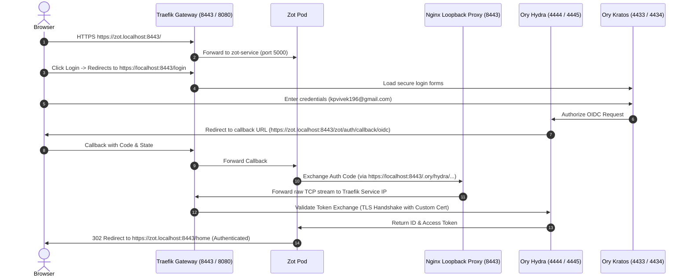

# Zot OIDC Integration - Solution C (Subdomain-Based Routing with HTTPS Ory Stack)

This directory contains the Kubernetes manifests for **Solution C**, which deploys a fully secure, subdomain-scoped container registry integrated with Ory Hydra and Kratos running entirely over HTTPS.

---

## 1. Architecture & Routing Flow

Solution C runs the entire user authentication lifecycle and backend APIs over secure HTTPS on port `8443` using a custom SAN certificate:

*   **Registry Domain**: `https://zot.localhost:8443` (subdomain-based)
*   **Ory Stack / UI / Backend**: `https://localhost:8443`



---

## 2. Key Features & Configurations

### A. Traefik HTTP-to-HTTPS Redirection ([`traefik.yaml`](file:///c:/Users/ADMIN/Desktop/notes/oryHydra/k8s3/traefik.yaml))
*   Includes a `redirect-to-https` middleware that intercepts any plain HTTP requests on port `8080` and redirects them permanently (301) to HTTPS port `8443`.
*   This prevents insecure cookie drops and solves the Kratos `security_csrf_violation` issue due to protocol mixing.

### B. Ory Stack HTTPS Configs ([`kratos.yaml`](file:///c:/Users/ADMIN/Desktop/notes/oryHydra/k8s3/kratos.yaml) & [`hydra.yaml`](file:///c:/Users/ADMIN/Desktop/notes/oryHydra/k8s3/hydra.yaml))
*   **Kratos**: Public base URL (`https://localhost:8443/.ory/kratos/`), CORS allowed origins, and return/UI URLs are set strictly to HTTPS.
*   **Hydra**: Issuer is set to `https://localhost:8443/.ory/hydra/`. All redirects (`URLS_LOGIN`, `URLS_CONSENT`, etc.) target HTTPS. Cookies are forced secure (`SERVE_COOKIES_SECURE=true`).

### C. Zot Trust & Loopback Proxy ([`zot.yaml`](file:///c:/Users/ADMIN/Desktop/notes/oryHydra/k8s3/zot.yaml))
*   **TCP Stream proxying**: The Nginx sidecar container (`loopback-proxy`) runs a TCP stream proxy on port `8443` to route Zot's local OIDC calls through Traefik dynamically.
*   **Trusted Root Certificate**: The public custom certificate (`tls.crt`) is mounted to `/etc/ssl/certs/ca-certificates.crt` inside the Zot registry container, letting it trust the self-signed gateway certificate natively.

---

## 3. Deployment Commands

To deploy Solution C:

```powershell

# 1. Deploy Solution C
kubectl apply -f ./k8s3
```

---

## 4. Verification

1.  Open an **Incognito Window** and navigate to `https://zot.localhost:8443/`.
2.  Click **Login** in the top right.
3.  Authenticate using your default credentials:
    *   **Email**: `kpvivek196@gmail.com`
    *   **Password**: `secretpassword`
4.  Consent to the permissions. You will be redirected back to `https://zot.localhost:8443/home` as an authenticated user.