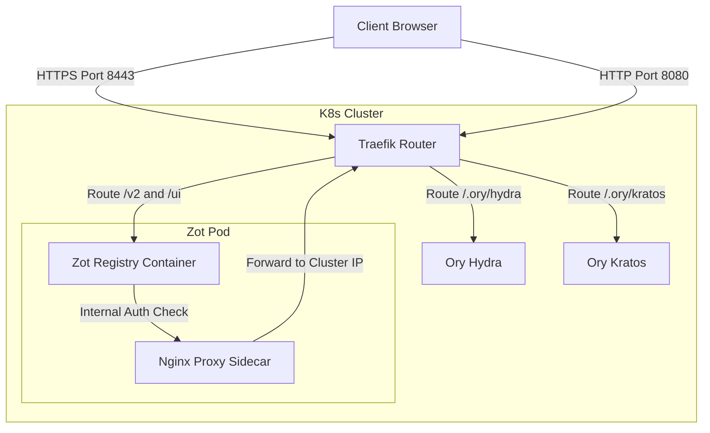

# Zot Registry OIDC & Traefik TLS Architecture Guide

This document explains the architecture, login flows, and implementation details for integrating the **Zot Container Registry** with the **Ory stack** (Hydra & Kratos) and exposing it over HTTPS via the **Traefik Gateway**.

---

## 1. High-Level Architecture Diagram

Here is how the different components communicate in your Kubernetes cluster:

---

## 2. OIDC Single Sign-On (SSO) Login Flow

1. **Access Registry**: You open `https://localhost:8443/` in your browser. Traefik receives this HTTPS request and routes it to the `zot-service` on port `5000`.
2. **Initiate Authentication**: You click "Login" on the Zot UI.
3. **Redirect to Identity Provider**: Zot redirects your browser to the Ory login page at `http://localhost:8080/login`.
4. **Log In**: You enter your Kratos credentials.
5. **Callback Redirect**: Upon successful authentication, Ory redirects your browser back to Zot at `https://localhost:8443/auth/callback/oidc` with an authorization code.
6. **Token Exchange**: Zot exchanges the authorization code for an ID token (OIDC session) and logs you in.

---

## 3. Why the Nginx Sidecar Proxy is Necessary

* **Strict OIDC Validation**: OpenID Connect specifications dictate that the client (Zot) must fetch the OIDC configuration from the issuer's discovery document (`/.well-known/openid-configuration`) and verify that the issuer matches exactly.
* **Issuer Mismatch**:
  * Ory Hydra is configured with the external issuer URL: `http://localhost:8080/.ory/hydra/`.
  * When Zot attempts to contact Ory Hydra inside the cluster using `http://localhost:8080/...`, the request fails because `localhost:8080` inside the Zot pod points to itself, not the Traefik router or Hydra.
* **The Sidecar Solution**:
  * We run an `nginx:alpine` container inside the Zot Pod network namespace (the sidecar).
  * This Nginx sidecar listens on port `8080` inside the Pod.
  * When Zot queries `http://localhost:8080/.ory/hydra/...`, it hits the local sidecar, which proxies the request to `http://traefik:8080/` inside the Kubernetes cluster.
  * This validates the issuer successfully without making any code edits to your application.

---

## 4. Resource Definitions & Volume Mounts

The deployment integrates with your existing volume mappings:

* **ConfigMap (`zot-config`)**: Mounted at `/etc/zot/config.json` containing the OIDC settings pointing to the credentials file at `/secret/credentials.json`.
* **Secret (`zot-secret`)**: Mounted at `/secret` containing the `credentials.json` OIDC credentials file.
* **Volume (`data`)**: Mounted at `/var/lib/registry` for image storage.
