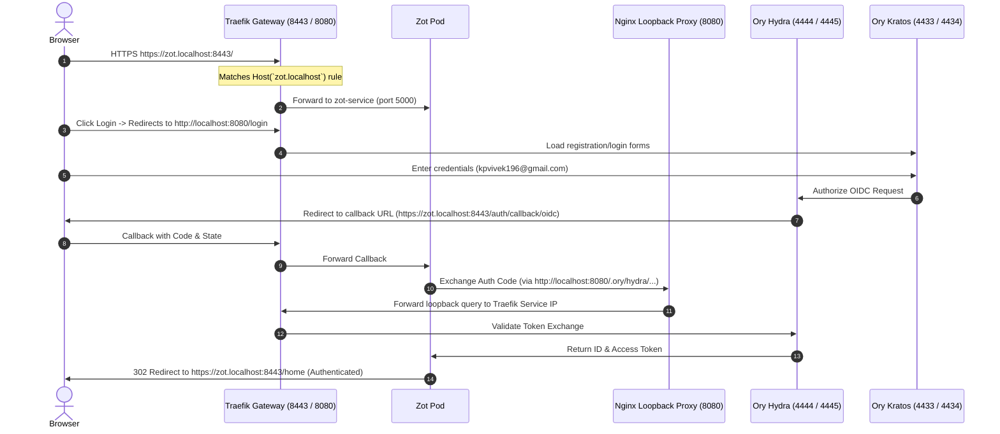

# Zot Subdomain-Based OIDC Integration Guide (Solution A)

This guide documents the architecture, configuration, and verification steps for **Solution A (Subdomain-Based Routing)** deployed from the [`k8s2/`](file:///c:/Users/ADMIN/Desktop/notes/oryHydra/k8s2) directory.

---

## 1. Prerequisites (Local DNS Setup)

Because Traefik routes Zot traffic using the `Host` HTTP header (`zot.localhost`), your local machine must know how to resolve this hostname.

Open your local hosts file:
* **Windows**: `C:\Windows\System32\drivers\etc\hosts`
* **Linux/macOS**: `/etc/hosts`

Add the following entry:
```text
127.0.0.1 zot.localhost
```

---

## 2. Deployment Commands

To deploy Solution A to your cluster:

```powershell
# 1. Tear down any existing Solution B setup
kubectl delete -f ./k8s --ignore-not-found

# 2. Deploy the subdomain routing stack
kubectl apply -f ./k8s2
```

---

## 3. Architecture & Routing Flow

Here is how traffic flows in **Solution A**:



---

## 4. Key Configuration Files

### A. Traefik Routing ([`k8s2/traefik.yaml`](file:///c:/Users/ADMIN/Desktop/notes/oryHydra/k8s2/traefik.yaml))
Uses the `Host` matcher so that port `8443` is mapped to Zot only when accessed via `zot.localhost`:
```yaml
zot-router:
  rule: "Host(`zot.localhost`)"
  entryPoints:
    - websecure
  service: zot-service
  tls: {}
```

### B. Zot Server Configuration ([`k8s2/zot.yaml`](file:///c:/Users/ADMIN/Desktop/notes/oryHydra/k8s2/zot.yaml))
* **`externalUrl`**: Configured to `https://zot.localhost:8443` to ensure Zot generates subdomain callback URIs.
* **`credentialsfile`**: Points to `/secret/credentials.json` which securely maps client credentials from the `zot-secret` Secret without trailing whitespace.
* **`extensions`**: The `search` and `ui` blocks are explicitly enabled to render the Web GUI.

### C. Ory Hydra Client Whitelist ([`k8s2/hydra.yaml`](file:///c:/Users/ADMIN/Desktop/notes/oryHydra/k8s2/hydra.yaml))
The registration job imports the `zot-client` and whitelists both subdomain endpoints:
- `https://zot.localhost:8443/auth/callback/oidc`
- `http://zot.localhost:8443/auth/callback/oidc`

---

## 5. Automated Seeding (Default User)

Solution A includes a seeder Job (`kratos-user-seeding`) that automatically runs after deployment. This job registers a default developer account so you don't have to manually sign up:

* **Username/Email**: `kpvivek196@gmail.com`
* **Password**: `secretpassword`

---

## 6. Local Testing & SSL Warnings

When opening `https://zot.localhost:8443/` in your browser:
1. **Self-Signed Certificate Warning**: Your browser will warn you that the certificate is untrusted.
2. **Action**: Click **Advanced** -> **Proceed to zot.localhost (unsafe)**. This is normal for local Kubernetes setups.
